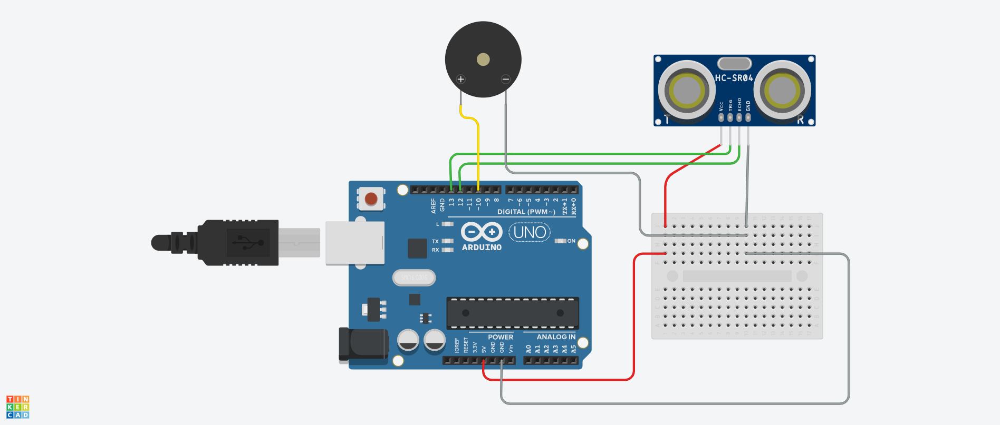
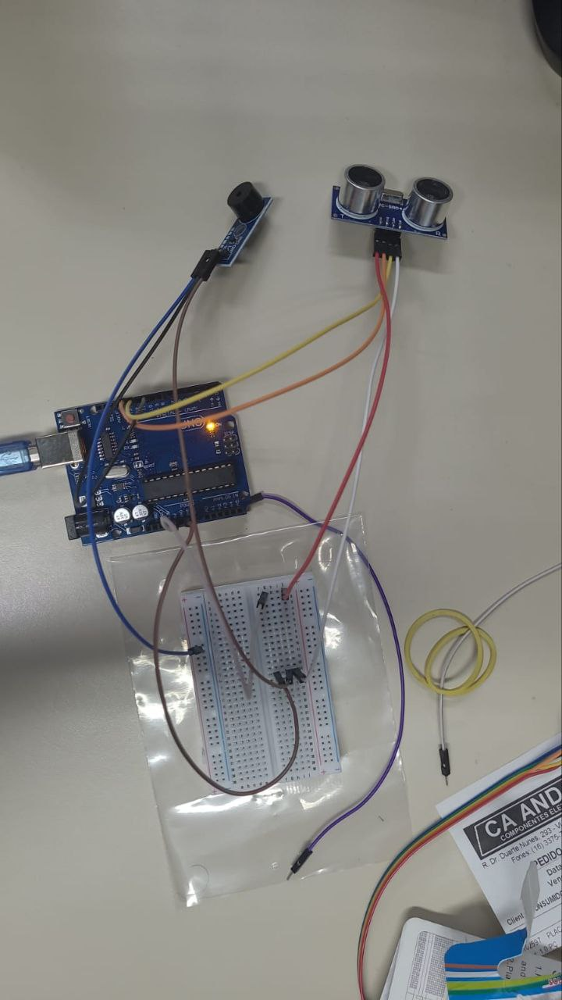
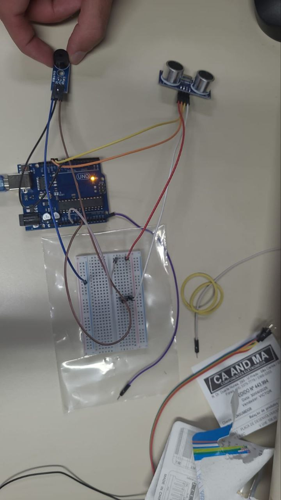

# Sensor de Estacionamento

## Descrição da Atividade

A atividade consistiu na montagem de um circuito que simula um sensor de estacionamento de carro.

Dessa forma, construímos um circuito que regula a frequência de bip de um buzzer passivo com base na distância captada por um sensor ultrassônico.

Dessa forma, uma menor distância entre sensor e obstáculo gera bips com maiores frequências, simulando um estacionamento.


## Alunos

* José Fausto Vital Barbosa - 15512767

* Pablo Henrique Almeida Vieira - 16895429

* Pedro Paulo Carvalho Coutinho - 16897011

* Roberto Brostel Barroso - 16899695


## Tabela de Gastos

| Quantidade | Componente | Descrição | Valor Unitário |
|----------|----------|----------|----------|
| 1 | Arduino | UNO | R$ 108,00 |
| 1 | Protoboard | BB-01 400P | R$ 21,70 |
| 1 | Kit Jumper | Macho-Macho + Macho-Fêmea | R$ 14,00 |
| 1 | Buzzer | Passivo 5V | R$ 12,00 |
| 1 | Sensor Ultrassônico | SR04-Open | R$ 7,00 |


Valor Total: R$ 162,70


## Simulação no Tinkercad




## Projeto Físico





## Vídeo Explicando o Circuito
==Link YouTube==


## Código Usado

```C++
//C++ Code

// Pinagem
const int trigPin = 13;
const int echoPin = 12;
const int buzzerPin = 10;

// Variáveis para o sensor
long duration;
int distance;

void setup() { //Configurando pinos de saída e entrada
  pinMode(trigPin, OUTPUT);
  pinMode(echoPin, INPUT);
  pinMode(buzzerPin, OUTPUT);
  Serial.begin(9600); //Para debug
}

void loop() {
  // Medindo a distância
  digitalWrite(trigPin, LOW); //Sem pulso por 2 microseg
  delayMicroseconds(2);
  digitalWrite(trigPin, HIGH); //Envia pulso por 10 microseg
  delayMicroseconds(10);
  digitalWrite(trigPin, LOW);

  //Quanto tempo o impulso ultrassônico 
  //demora para retornar ao sensor
  duration = pulseIn(echoPin, HIGH);
  
  //Distância baseada na duração e velocidade do som
  distance = duration * 0.034 / 2;

  // Limita o mapeamento da distância de 0 a 200 cm
  int distLimit = constrain(distance, 0, 200);

  // Mapeando a distância para valor PWM
  int frequencia = map(distLimit, 0, 200, 6000, 200);
  // 5 é o valor mínimo do buzzer (evitar silêncio do buzzer)
  //255 é o máximo (menor distância = maior frequência)
  //Objeto mais próximo = PWM maior = buzzer com maior frequência
  
  // Fazendo o Buzzer apitar em intervalos de 50 ms
  tone(buzzerPin, frequencia); 
  delay(50);                      // Duração do buzz
  noTone(buzzerPin);      // Off
  delay(25);                      // Espera até próximo ciclo

  // --- Para debugar, é possível ver essas info no simulador ---
  Serial.print("Distância: ");
  Serial.print(distance);
  Serial.print(" cm | Frequência: ");
  Serial.println(frequencia);
}
```
